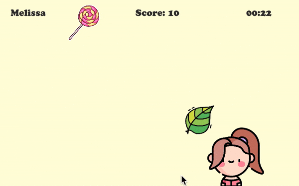

# Candy Catcher

### Github Pages
https://5ahmnm2122.github.io/11CandyCatcher-millig/

### Project description: 
In the IntroScene you can fill in your name and then click on a button to switch into the MainScene. Your name is displayed at the top left corner. You have to move the player to the left or right side to pick up candy, but try to avoid the leaves. Your score will be shown at the top. There is also a timer of 30 sec. If the time is over you switch to the EndScene, where you can see your name and score. You can also restart the game if you want.

### Development platform: 
MacOS Big Sur 11.5.2, Unity 2020.3.18f1, Visual Studio Code 1.63.2)

### Target platform: 
WebGL 960x600

### Visuals: 
 

### Third party material: 
+ Font: CooperBlackStd
+ Player: https://www.flaticon.com/premium-icon/girl_2423830?term=girl&page=1&position=5&page=1&position=5&related_id=2423830&origin=search
+ Candy: https://www.flaticon.com/free-sticker/candy_6347547?term=candy&page=1&position=91&page=1&position=91&related_id=6347547&origin=search
https://www.pinclipart.com/maxpin/xJhwTR/
+ Leave: https://www.flaticon.com/free-icon/leave_1409016?related_id=1409016&origin=search

### Project state: 
95% - Score is not displayed in the EndScene

### Lessons Learned: 
+ creating Prefabs
+ Timer
+ life cycle of objects

Copyright by millig
